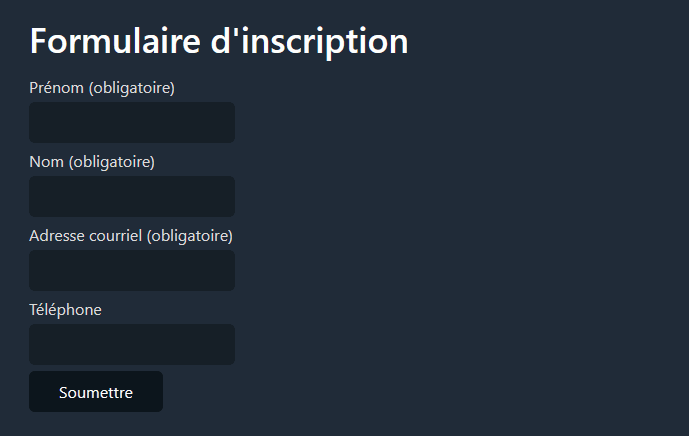

# Laboratoire 05-A

L'objectif de ce laboratoire est de vous faire créer vos premières classes en PHP. Vous allez implémenter les classes nécessaires à la génération d'un formulaire tout en objets.

Dans le fichier `index.php`, vous trouverez une variable contenant le numéro de l'étape du laboratoire sur lequel vous êtes en train de travailler. Selon ce numéro, un des fichiers du dossier `tests` sera inclus. Ouvrez le fichier `tests/etape1.php` et prenez connaissance de son contenu. Vous verrez qu'il instancie plusieurs objets de la classe `ChampTexte`.

Suivez les consignes ci-dessous pour implémenter les différentes classes dans les fichiers correspondants du dossier `classes`, en mettant à jour la variable `$etape` à chaque fois. **Vous ne devez en aucun cas modifier les fichiers du dossier `tests`.**

## Étape 1 - Classe `ChampTexte`

Cette classe permet de générer un champ texte.

La classe doit avoir les attributs suivants:

* `$nom`: indique le nom du champ qui apparaîtra dans l'attribut `name` de la balise HTML `input` lorsque celle-ci sera générée.
* `$libelle`: indique le texte qui sera affiché comme libellé du champ.
* `$estObligatoire`: booléen indiquant si le champ est obligatoire ou non.
* `$erreur`: contient un texte d'erreur si la valeur saisie dans le champ est invalide.

Le constructeur doit prendre 3 paramètres permettant d'initialiser les attributs `$nom`, `$libelle` et `$estObligatoire`. Il doit initialiser l'attribut `$erreur` à `null`.

Les méthodes suivantes doivent être implémentées:

* `getLibelle()`: retourne la valeur du libellé
* `estRecu()`: retourne un booléen indiquant si ce champ a été reçu ou non (via `$_POST`)
* `getValeur()`: si le champ a été reçu, retourne sa valeur, sinon retourne `null`. Les balises HTML doivent être désactivées dans la valeur retournée. Les espaces au début et à la fin de la valeur doivent aussi avoir été retirés (voir la fonction [trim](https://www.php.net/manual/fr/function.trim.php)).
* `valider()`: si le champ est obligatoire et n'a pas été reçu, insère un message d'erreur en conséquence dans `$erreur`. Si le champ est obligatoire et a été reçu, mais est vide (voir la fonction [empty](https://www.php.net/manual/fr/function.empty.php)), insère le même message d'erreur.
* `getErreur`: retourne la valeur de l'attribut `$erreur`.
* `html`: retourne le HTML permettant d'afficher le champ.

Voici le résultat que vous devriez obtenir avec la valeur `$etape = 1` dans `index.php`:

## Étape 2 - Classe `ChampNombre`

Cette classe permet de générer un champ numérique.

La classe doit avoir les attributs suivants:

* `$nom`: indique le nom du champ qui apparaîtra dans l'attribut `name` de la balise HTML `input` lorsque celle-ci sera générée.
* `$libelle`: indique le texte qui sera affiché comme libellé du champ.
* `$estObligatoire`: booléen indiquant si le champ est obligatoire ou non.
* `$erreur`: contient un texte d'erreur si la valeur saisie dans le champ est invalide.
* `$valeurMin`: indique la valeur minimale acceptée.
* `$valeurMax`: indique la valeur maximale acceptée.
* `$doitEtreEntier`: booléen indiquant si le nombre saisi doit être un entier.

Le constructeur doit prendre 4 paramètres permettant d'initialiser les attributs `$nom`, `$libelle`, `$estObligatoire` et `$doitEtreEntier`.. Il doit initialiser l'attribut `$erreur` à `null`, l'attribut `$valeurMin` à `-INF` et `$valeurMax` à `INF`.
    
> `INF` représente l'infini en PHP. Autrement dit, par défaut il n'y a pas de valeurs minimale et maximale. En mettant l'infini, on s'évite d'écrire du code supplémentaire pour gérer le cas par défaut.

Les méthodes suivantes doivent être implémentées:

* `setValeurMin($valeurMin)` et `setValeurMax($valeurMax)` qui permet de changer la valeur des attributs correspondants
* `getLibelle()`: retourne la valeur du libellé
* `estRecu()`: retourne un booléen indiquant si ce champ a été reçu ou non (via `$_POST`)
* `getValeur()`: si le champ a été reçu, retourne sa valeur, sinon retourne `null`. Les balises HTML doivent être désactivées dans la valeur retournée. Les espaces au début et à la fin de la valeur doivent aussi avoir été retirés (voir la fonction [trim](https://www.php.net/manual/fr/function.trim.php)).
* `valider()`: valide la valeur et insère le message approprié dans l'attribut `$erreur` si elle est invalide. Pensez à tous les cas où un message d'erreur est nécessaire.
* `getErreur`: retourne la valeur de l'attribut `$erreur`.
* `html`: retourne le HTML permettant d'afficher le champ.

Voici le résultat que vous devriez obtenir avec la valeur `$etape = 2` dans `index.php`:

## Étape 3 - Classe `ListeDeroulante`

Cette classe permet de générer une liste déroulante.

La classe doit avoir les attributs suivants:

* `$nom`: indique le nom du champ qui apparaîtra dans l'attribut `name` de la balise HTML `input` lorsque celle-ci sera générée.
* `$libelle`: indique le texte qui sera affiché comme libellé du champ.
* `$estObligatoire`: booléen indiquant si le champ est obligatoire ou non.
* `$erreur`: contient un texte d'erreur si la valeur saisie dans le champ est invalide.
* `$options`: un tableau contenant les options de la liste déroulante.

Le constructeur doit prendre 3 paramètres permettant d'initialiser les attributs `$nom`, `$libelle` et `$estObligatoire`. Il doit initialiser l'attribut `$erreur` à `null`.

Les méthodes suivantes doivent être implémentées:

* `ajouterOption($option)`: ajoute la chaîne de caractères reçue en paramètre au tableau `$options`
* `getLibelle()`: retourne la valeur du libellé
* `estRecu()`: retourne un booléen indiquant si ce champ a été reçu ou non (via `$_POST`)
* `getValeur()`: si le champ a été reçu, retourne sa valeur, sinon retourne `null`. Les balises HTML doivent être désactivées dans la valeur retournée. Les espaces au début et à la fin de la valeur doivent aussi avoir été retirés (voir la fonction [trim](https://www.php.net/manual/fr/function.trim.php)).
* `valider()`: valide la valeur et insère le message approprié dans l'attribut `$erreur` si elle est invalide. Pensez à tous les cas où un message d'erreur est nécessaire.
* `getErreur`: retourne la valeur de l'attribut `$erreur`.
* `html`: retourne le HTML permettant d'afficher le champ.

Voici le résultat que vous devriez obtenir avec la valeur `$etape = 3` dans `index.php`:

## Étape 4 - Classe `GroupeBoutonsRadio`

La classe `GroupeBoutonsRadio` permet d'aficher des boutons radio dans un `fieldset`. Elle est très semblable à la classe `ListeDeroulante`. À vous de déterminer quoi changer par rapport au code de cette classe.

Voici le résultat que vous devriez obtenir avec la valeur `$etape = 4` dans `index.php`:

## Étape 5 - Classe `Formulaire`

Vous devez maintenant créer une classe `Formulaire` qui contiendra tous les champs. Elle doit avoir un attribut `$titre` indiquant le titre du formulaire qui sera affiché dans une balise `h1`, ainsi qu'un attribut `$champs` contenant un tableau de champs.

Le constructeur prend un seul paramètre `$titre` pour initialiser l'attribut `$titre`.

Une méthode `ajouterChamp($champ)` reçoit un paramètre soit de type `ChampNombre`, `ChampTexte`, `GroupeBoutonsRadio` ou `ListeDeroulante`, et l'ajoute au tableau `$champs`.

Une méthode `estRecu` utilise la méthode du même nom de chaque champ et retourne  `true` s'ils ont tous été reçus, ou `false` si ce n'est pas le cas.

Une méthode `estValide` appelle la méthode `valider` de chaque champ, puis la méthode `getErreur` de chaque champ. Si la méthode `getErreur` retourne une valeur autre que `null` pour au moins un des champs, la méthode `estValide` retourne `false`. Sinon, elle retourne `true`.

La méthode `getChamps` retourne le tableau `champs`.

La méthode `html` retourne le HTML permettant d'afficher le formulaire. Elle utilise la méthode `html` de chacun des champs.

Le résultat visuel avec la valeur `$etape = 5` dans `index.php` devrait être le même qu'avec `$etape = 4`.